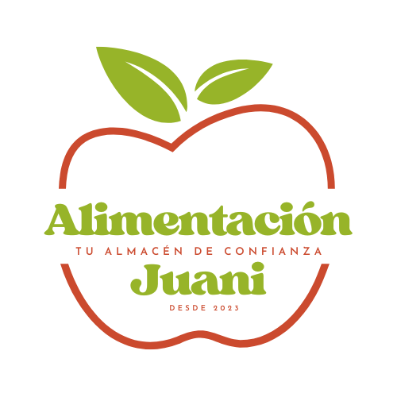

# Ficha de Empresa

## Nombre de la Empresa
**Alimentación Juani**  

---

## Descripción

**Somos un pequeño almacén de barrio especializado en productos de alimentación. Ofrecemos alimentos frescos, productos básicos y artículos de despensa para satisfacer las necesidades diarias de nuestros vecinos. Nuestro compromiso es proporcionar un servicio cercano y de confianza, apoyando a productores locales y garantizando la calidad en cada uno de nuestros productos.** 

---

## Información General

- **Razón Social:** Juani Olivero Rojas
- **Sector:** Alimentación
- **Fecha de Fundación:** 10/12/2023
- **Número de Identificación Fiscal:** B76483952

---

## Ubicación y Contacto

- **Dirección:** 2 Av. Segunda Aguada
- **Teléfono:** +34 678 03 49 32
- **Correo Electrónico:** contacto@alimentacionjuani.es
- **Página Web:** alimentacionjuani.es

---

## Productos y Servicios

1. **Frutas y verduras frescas:** Frutas y verduras, del día, de la zona.
2. **Productos de despensa:** Un gran abanico de alimentos de despensa, como arroz, pastas, legumbres.
3. **Panadería y bollería:** Pan y bollos hechos artesanalmente.

---

## Clientes
- Este negocio va dirigido a clientes de todo tipo de edades que quieran comprar tanto de forma física como online.
- Principalmente está dirigida a clientes cercanos a la ubicación del negocio, aunque busca expandirse nacionalmente de manera online a través de su web.
- Está tipo de negocio está dirigido a una población de clase baja-media, ya que sus productos se encuentran al alcance de todo el mundo.

---

## Equipo y Recursos Humanos

- **Representante Legal:** Juani Olivero Rojas
- **Número de Empleados:** 1
---

## Información Adicional

- **Certificaciones:** 
	- **Certificación de Manipulación de Alimentos:** Garantizamos que todo nuestro personal cumple con las normativas de seguridad alimentaria y ha recibido formación en manipulación higiénica.
	- **Sello de Calidad Local:** Reconocidos como promotores de productos frescos de origen local.
- **Responsabilidad Social Empresarial:** 
	- **Apoyo a Productores Locales:** Colaboramos activamente con agricultores y proveedores locales para fomentar el desarrollo de la economía de nuestra comunidad.
	- **Donaciones a Bancos de Alimentos:** Contribuimos regularmente con productos no perecederos a organizaciones benéficas locales.
	- 
- **Sostenibilidad:** 
	- **Reducción de Plásticos:** Fomentamos el uso de bolsas reutilizables y ofrecemos alternativas biodegradables en el empaque de nuestros productos.
	-   **Gestión de Residuos:** Implementamos un sistema de reciclaje efectivo en nuestro almacén.
	- **Productos Eco-Friendly:** Contamos con una selección de productos ecológicos y sostenibles, promoviendo prácticas responsables con el medio ambiente.

---

